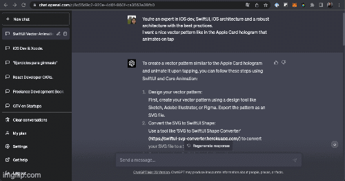

# Hologram SwiftUI with ChatGPT 👋

An app with animations in SwiftUI with the help of ChatGPT4 [SwiftUI with ChatGPT4](https://designcode.io/gpt4-swiftui)

<a href="#">

  
</a>  
  
     Hologram SwiftUI
      
  
  
   
     
    <a href="https://github.com/brenfondeadora/Hologram_SwiftUI_ChatGPT/issues/new">Report bug</a>
    ·
    <a href="https://github.com/brenfondeadora/Hologram_SwiftUI_ChatGPT/issues/new">Request feature</a>

## 👤 Author

**Brenda Saavedra**

- WebPage: [brendasaavedra.com](http://brendasaavedra.com)
- Github: [@brenfondeadora](https://github.com/brenfondeadora/)
